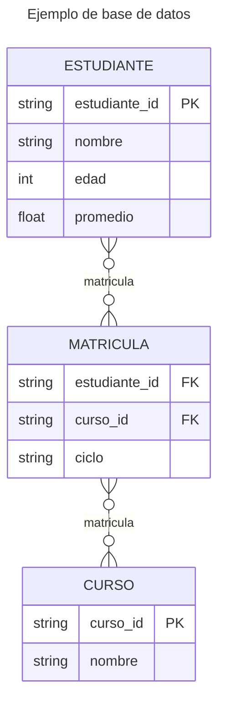

# Almacenamiento de datos

### ¿Dónde son almacenados los datos?

Luego de la recopilación, el análisis de datos típicamente continúa con el almacenamiento de datos. Las bases de datos ofrecen almacenamiento permanente y son una solución en el caso de grandes cantidades de datos.

**Nota**: No siempre es necesario almacenar los datos de esta forma. A menudo es suficiente hacer el análisis de los datos y luego desecharlos.

Hay distintos tipos de bases de datos y las *bases de datos relacionales* son las más comunes.

#### Bases de datos relacionales

Las bases de datos relacionales almacenan datos *tabulares* -y por tanto "planos" y "no anidados"- en tablas con columnas, también llamadas *campos* (*fields*), y filas, también llamadas *registros* (*records*). Cada tabla tiene una *llave primaria* (PK, *primary key*) que identifica de forma única cada registro. Las tablas están relacionadas entre sí (de ahí el nombre *relacional*) con *llaves foráneas* (FK, *foreign key*) que hacen referencia a un registro de otra tabla, creando una estructura lógica entre las tablas de una misma base de datos.

En el siguiente *diagrama entidad-relación* (ERD) simplificado, una tabla tiene datos de estudiantes, otra tabla tiene datos de los cursos y una tercera tabla vincula cursos con estudiantes (relación muchos-a-muchos, *many-to-many*) con llaves foráneas a las dos tablas anteriores.



En esta base de datos están almacenados todos los estudiantes que tiene un curso para un ciclo particular.

Las bases de datos relacionales más utilizadas son tipo SQL (*Structured Query Language*), que utilizan un lenguaje especial para hacer consultas a la base de datos. Por ejemplo:

```sql
SELECT nombre, edad FROM estudiantes WHERE id = B00000;
```

devuelve los datos `nombre` y `edad` (pero no `promedio`) del carné B00000 en la tabla `estudiantes`.

Las consultas (*queries*) de SQL pueden ser complejas. Por ejemplo:

```sql
SELECT ESTUDIANTE.*
FROM ESTUDIANTE
JOIN MATRICULA ON ESTUDIANTE.estudiante_id = MATRICULA.estudiante_id
WHERE MATRICULA.curso_id = 'IE0405' AND MATRICULA.ciclo = '2027-1';
```

devuelve todos los datos de los estudiantes matriculados en el curso IE0405 en el primer ciclo del 2027.

En general, las bases de datos tienen *transacciones* del tipo: lectura, creación, actualización y eliminación de registros (CRUD, *Create*, *Read*, *Update*, *Delete*).

Los sistemas de administración de bases de datos (DBMS, *Data Base Management System*) más populares son PostgreSQL, SQLite3, MySQL, MariaDB, Oracle y otros.

##### Mapeadores relacionales de objetos

Es posible utilizar otros lenguajes de programación para hacer transacciones con bases de datos, por medio de un mapeador relacional de objetos (ORM, *Object-Relational Mapping*), una  técnica para "mapear" una tabla en un objeto y utilizar la programación orientada a objetos para manipular los datos. La misma búsqueda de estudiantes matriculados en un curso para un ciclo particular en el SQL de ejemplo anterior, ahora en Python con SQLAlchemy sería:

```python
students = session.query(Estudiante).join(Matricula).filter(
    Matricula.curso_id == "IE0405",
    Matricula.ciclo == "2027-1"
).all()
```

**Nota**: Ver [sección](#bases-de-datos-e-interfaces-orm) más adelante.


### Bases de datos e interfaces ORM

El uso de bases de datos es un área compleja y especializada, sin embargo, hay herramientas en Python que facilitan su gestión.

En particular, la recomendación es utilizar un mapeador relacional de objetos (ORM, *Object-Relational Mapping*), que representa las tablas y sus datos como una *clase* en un lenguaje de programación, habilitando la interacción con la base de datos con el paradigma orientado a objetos, y abstrayendo la especificidad de distintas bases de datos utilizadas.

En Python existe [SQLAlchemy](https://www.sqlalchemy.org/), un poderoso paquete para interactuar con los DBMS más populares.

El ejemplo de la tabla de datos de estudiantes, cursos y matrícula mostrados anteriormente, puede ser implementado de la siguiente forma.

```python title="Definición de modelos de la base de datos"
from sqlalchemy import create_engine, Column, ForeignKey, Integer, Float, String
from sqlalchemy.ext.declarative import declarative_base
from sqlalchemy.orm import sessionmaker

# Crear la clase base de cada tabla
Base = declarative_base()


# Definir los modelos
class Estudiante(Base):
    __tablename__ = "estudiantes"

    estudiante_id = Column(String, primary_key=True)
    nombre = Column(String)
    edad = Column(Integer)
    promedio = Column(Float)


class Curso(Base):
    __tablename__: = "cursos"

    curso_id = Column(String, primary_key=True)
    nombre = Column(String)


class Matricula(Base):
    __tablename__ = "matriculas"

    estudiante_id = Column(String, ForeignKey("estudiantes.estudiante_id"), primary_key=True)
    curso_id = Column(String, ForeignKey("cursos.curso_id"), primary_key=True)
    ciclo = Column(String, primary_key=True)

    # Definir relación de matrícula con los modelos de estudiante y curso
    estudiante = relationship("Estudiante")
    curso = relationship("Curso")
```

Aquí fueron creadas las tres tablas, donde `matriculas` hace referencia por medio de llaves foráneas a las llaves primarias `estudiantes.estudiante_id` y `cursos.curso_id`. En esta misma tabla nótese también que las tres columnas tienen `primary_key=True`, lo que indica una *llave primaria compuesta*, para lo cual cada registro debe tener una *combinación única* de estudiante, curso y ciclo lectivo.

Finalmente, hay que crear las tablas estableciendo un `engine` o referencia a la base de datos a utilizar (en este caso SQLite3) y crear una *sesión* ligada a ese `engine`, para poder ejecutar las transacciones deseadas.

```python
# Crear la conexión a la base de datos SQLite3
engine = create_engine(f"sqlite:///{name}")
Session = sessionmaker(bind=engine)
session = Session()

# Crear la(s) tabla(s) en la base de datos
Base.metadata.create_all(engine)
```

!!! warning "Migraciones"
    En este proyecto no está determinado un mecanismo fundamental de *migraciones*, que son necesarias para el caso, completamente usual, en el que hay que realizar una actualización en la base de datos cuando hay cambios en los modelos (*clases*), conservando al mismo tiempo los datos ya almacenados. Por ejemplo, para cambiar el tipo de dato de `estudiante_id` de `String` a `Integer` hay que hacer una migración. [Alembic](https://alembic.sqlalchemy.org/en/latest/) es la forma de hacerlo con SQLAlchemy, pero no está dentro de los alcances del proyecto.

Para el proyecto la recomendación es utilizar SQLite o PostgreSQL. Una diferencia básica entre ambos es que SQLite3 existe como un archivo binario (por ejemplo, `db.sqlite3` o `data.db`) mientras que PostgreSQL es un programa propiamente, instalado en la computadora o servidor. Para proyectos de gran escala PostgreSQL es recomendado, sin embargo SQLite3 tiene capacidad para manejar cientos de millones de datos, así que en nuestro proyecto no es un problema. Quizá hay que tener más cuidado de no borrar el archivo "de un dedazo".
