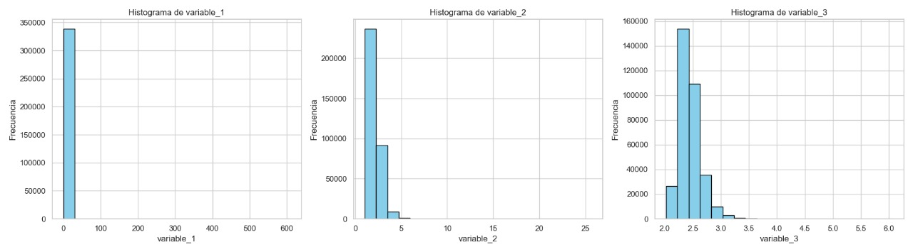

# Datos recolectados

## Recolección y almacenamiento de datos

La recolección de datos se lleva a cabo mediante una **tarea programada** que consulta de manera periódica una **API externa**, la cual proporciona información relevante para el análisis. Esta tarea está diseñada para ejecutarse de forma automatizada en intervalos específicos, lo que permite la obtención constante de nuevos datos.

Una vez que los datos son obtenidos a través de la API, se procesan y se almacenan de manera eficiente en una base de datos relacional, utilizando **SQLite** como motor de almacenamiento. Los datos se organizan en una tabla denominada `test_data`, que contiene múltiples columnas correspondientes a las variables de interés.

### Proceso de recolección de datos

El proceso de recolección de datos incluye los siguientes pasos:

1. **Consulta a la API**:
   Se realiza una solicitud GET a la API, pasando los parámetros necesarios para obtener el conjunto de datos específico para el grupo de interés.

2. **Extracción y deserialización**:
   La respuesta obtenida de la API, generalmente en formato **JSON**, es deserializada para extraer los valores de interés.

3. **Almacenamiento en la base de datos**:
   Los datos extraídos se almacenan en la tabla `test_data`, que está diseñada para contener información de múltiples variables, cada una representada por una columna en la base de datos.

4. **Automatización**:
   Este proceso se repite de forma periódica, lo que garantiza que los datos estén siempre actualizados y disponibles para su posterior análisis.

A continuación, se presenta una vista previa de las primeras filas registradas en la tabla `test_data`, que reflejan el resultado de este proceso automatizado de recolección.

## Vista previa de los datos
<div align="center">

<table>
  <thead>
    <tr>
      <th>id</th>
      <th>grupo</th>
      <th>timestamp</th>
      <th>variable_1</th>
      <th>variable_2</th>
      <th>variable_3</th>
    </tr>
  </thead>
  <tbody>
    <tr>
      <td>1</td>
      <td>15</td>
      <td>2025-05-29 22:09:51.000</td>
      <td>0.908063241460095</td>
      <td>1.95292352340578</td>
      <td>2.39747040162065</td>
    </tr>
    <tr>
      <td>2</td>
      <td>15</td>
      <td>2025-05-29 22:09:51.000</td>
      <td>0.559063700558236</td>
      <td>1.74770562426548</td>
      <td>2.32200817859251</td>
    </tr>
    <tr>
      <td>3</td>
      <td>15</td>
      <td>2025-05-29 22:09:51.000</td>
      <td>0.435940710088689</td>
      <td>1.66025806325155</td>
      <td>2.28851001674475</td>
    </tr>
    <tr>
      <td>4</td>
      <td>15</td>
      <td>2025-05-29 22:09:51.000</td>
      <td>0.139710101087961</td>
      <td>1.37377814420851</td>
      <td>2.17208282310104</td>
    </tr>
    <tr>
      <td>5</td>
      <td>15</td>
      <td>2025-05-29 22:09:51.000</td>
      <td>0.873013896622738</td>
      <td>1.93435212667534</td>
      <td>2.39080988157093</td>
    </tr>
    <tr>
      <td>6</td>
      <td>15</td>
      <td>2025-05-29 22:09:51.000</td>
      <td>1.64848145222954</td>
      <td>2.28393202788525</td>
      <td>2.51126835071911</td>
    </tr>
    <tr>
      <td>7</td>
      <td>15</td>
      <td>2025-05-29 22:09:51.000</td>
      <td>0.608693994965501</td>
      <td>1.78018843554971</td>
      <td>2.33423702375167</td>
    </tr>
    <tr>
      <td>8</td>
      <td>15</td>
      <td>2025-05-29 22:09:51.000</td>
      <td>1.60897442238196</td>
      <td>2.26845355546901</td>
      <td>2.50613862425376</td>
    </tr>
    <tr>
      <td>9</td>
      <td>15</td>
      <td>2025-05-29 22:09:51.000</td>
      <td>0.418911021449049</td>
      <td>1.64723335934503</td>
      <td>2.28344589264411</td>
    </tr>
    <tr>
      <td>10</td>
      <td>15</td>
      <td>2025-05-29 22:09:51.000</td>
      <td>0.556039327666595</td>
      <td>1.74568044608035</td>
      <td>2.32124200889934</td>
    </tr>
  </tbody>
</table>

</div>


## Descargar todos los datos

Puedes descargar todos los datos en formato CSV desde el siguiente enlace:

[⬇️ Descargar datos en CSV](files/datos.csv)A continuación, se detalla el propósito de cada bloque del código usado para generar los histogramas:

---
# Histogramas 
A continuación, se detalla el propósito de cada bloque del código usado para generar los histogramas:

---

### Importación de librerías

```python
import pandas as pd
import matplotlib.pyplot as plt
import seaborn as sns
import plotly.express as px
```

Se importan librerías esenciales para análisis y visualización de datos:

- `pandas`: manipulación de datos en forma de tablas.
- `matplotlib.pyplot`: creación de gráficos estáticos.
- `seaborn`: mejora estética de los gráficos sobre `matplotlib`.
- `plotly.express`: gráficos interactivos (aunque no se usa en este caso).

---

### Carga del archivo CSV

```python
base_dir = os.path.dirname(__file__)
file_path = os.path.join(base_dir, 'files', 'datos.csv')
df = pd.read_csv(file_path)
```

Se obtiene la ruta del directorio donde está el script usando __file__. Se construye una ruta relativa al archivo datos.csv ubicado en la subcarpeta files. Se carga el archivo CSV en un DataFrame (df), una estructura tipo tabla de Pandas.

---

### Configuración del estilo visual

```python
sns.set(style="whitegrid")
```

Establece un estilo visual para los gráficos con fondo blanco y cuadrícula, usando Seaborn.

---

### Creación de histogramas

```python
fig, axes = plt.subplots(1, 3, figsize=(18, 5))
variables = ['variable_1', 'variable_2', 'variable_3']
```

- Se crean 3 gráficos (subplots) en una sola fila.
- `figsize` determina el tamaño total de la figura.

---

### Bucle para graficar cada variable

```python
for ax, var in zip(axes, variables):
    ax.hist(df[var], bins=20, color='skyblue', edgecolor='black')
    ax.set_title(f'Histograma de {var}')
    ax.set_xlabel(var)
    ax.set_ylabel('Frecuencia')
```

Por cada variable, se genera un histograma con:

- 20 intervalos (`bins`)
- Color de barra celeste con bordes negros
- Títulos y etiquetas correspondientes


# Análisis Exploratorio de Datos - Histogramas

Este análisis se basa en los histogramas generados para tres variables contenidas en un conjunto de datos extraído de un archivo Excel. A continuación, se describe la distribución observada para cada una de las variables.



---

## Histograma de `variable_1`

- **Forma de la distribución**: Extremadamente sesgada a la derecha (asimetría positiva).
- **Observación**: Casi todos los valores están concentrados entre 0 y 20.
- **Rango máximo observado**: El eje x alcanza hasta 600, pero muy pocos datos se encuentran en ese rango.
- **Interpretación**: 
  - La mayoría de las observaciones tienen valores muy pequeños.
  - Existen valores atípicos (outliers) significativamente altos.
  - Puede tratarse de una variable como ingresos, tiempos de espera, tamaños de archivos, etc.

---

## Histograma de `variable_2`

- **Forma de la distribución**: Sesgada a la derecha.
- **Observación**: Alta concentración de valores entre 0 y 4.
- **Rango máximo observado**: Hasta 25, pero con frecuencia muy baja más allá de 5.
- **Interpretación**:
  - Puede representar conteos (por ejemplo, número de eventos).
  - También podría reflejar una distribución exponencial.

---

## Histograma de `variable_3`

- **Forma de la distribución**: Ligeramente sesgada a la derecha, pero más acotada y simétrica.
- **Observación**: La mayoría de los valores se encuentran entre 2.0 y 3.0.
- **No se observan outliers significativos.**
- **Interpretación**:
  - Podría representar calificaciones, puntajes, o variables normalizadas.
  - Es la variable más "estable" entre las tres analizadas.

---


# Modelos de Datos

### Cálculos realizados
Para cada variable se calcularon momentos estadísticos de los cuales a continuación se presentan las fórmulas con las cuales se obtuvieron y por facilidad de comprensión se realiza una tabla resumen con los datos recopilados de estos cálculos realizados:

1. **Promedio (Media)**
   $$ \mu = \frac{1}{n} \sum_{i=1}^{n} x_i $$

2. **Varianza**
   $$ \sigma^2 = \frac{1}{n-1} \sum_{i=1}^{n} (x_i - \mu)^2 $$

3. **Desviación estándar**
   $$ \sigma = \sqrt{\sigma^2} $$

4. **Inclinación (skewness)**
   $$ \text{skew}(x) = \frac{1}{n} \sum_{i=1}^{n} \left( \frac{x_i - \mu}{\sigma} \right)^3 $$

5. **Curtosis (kurtosis)**
   $$ \text{kurt}(x) = \frac{1}{n} \sum_{i=1}^{n} \left( \frac{x_i - \mu}{\sigma} \right)^4 $$


### Resultados Obtenidos

<div style="text-align: center;">

<table>
  <thead>
    <tr>
      <th>Momento</th>
      <th>variable_1</th>
      <th>variable_2</th>
      <th>variable_3</th>
    </tr>
  </thead>
  <tbody>
    <tr>
      <td><strong>Promedio</strong></td>
      <td>1.182916</td>
      <td>2.131259</td>
      <td>2.447002</td>
    </tr>
    <tr>
      <td><strong>Varianza</strong></td>
      <td>8.837140</td>
      <td>0.385909</td>
      <td>0.037444</td>
    </tr>
    <tr>
      <td><strong>Desviación estándar</strong></td>
      <td>2.972733</td>
      <td>0.621216</td>
      <td>0.193504</td>
    </tr>
    <tr>
      <td><strong>Inclinación (skew)</strong></td>
      <td>43.915523</td>
      <td>2.713515</td>
      <td>1.479704</td>
    </tr>
    <tr>
      <td><strong>Curtosis</strong></td>
      <td>6403.742860</td>
      <td>24.254801</td>
      <td>5.312837</td>
    </tr>
  </tbody>
</table>

</div>

### Interpretación de los resultados


#### **Promedio (Media)**

El **promedio** (o media aritmética) de una variable es una medida de tendencia central que nos indica el valor alrededor del cual se agrupan los datos. En este análisis, se observa que la variable `variable_3` tiene el promedio más alto en comparación con las otras variables. Este valor elevado sugiere que los datos de `variable_3` tienden a ser mayores en general, lo que podría indicar una mayor prevalencia de valores altos en esta variable en relación con `variable_1` y `variable_2`.

#### **Varianza**

La **varianza** mide la dispersión de los datos en torno a la media. Un valor alto de varianza indica que los datos están más dispersos. En este caso, `variable_1` tiene una **varianza significativamente mayor** que las otras dos variables. Esto sugiere que los valores de `variable_1` están más esparcidos y presentan una mayor variabilidad en comparación con `variable_2` y `variable_3`. Una varianza alta puede implicar que esta variable tiene un rango más amplio de valores o que se encuentran más alejados de la media.

#### **Desviación estándar**

La **desviación estándar** es simplemente la raíz cuadrada de la varianza y proporciona una medida más intuitiva de la dispersión, ya que se expresa en las mismas unidades que los datos. En este análisis, la **desviación estándar de `variable_1`** es también la más alta, lo que refuerza la observación de que los valores de esta variable están más dispersos. Al tener una mayor desviación estándar, se puede inferir que **`variable_1`** es más propensa a tener **valores atípicos o extremos**, lo cual debe ser considerado al interpretar los resultados.

#### **Inclinación (skewness)**

La **inclinación (skewness)** mide la asimetría de la distribución de los datos. Un valor de skewness positivo indica que los datos están sesgados hacia la derecha, es decir, que la cola de la distribución se extiende hacia los valores más grandes. En este caso, **`variable_1`** muestra una inclinación extremadamente alta (skewness = 43.92), lo que indica que la distribución de `variable_1` está **muy sesgada hacia los valores más altos**. Esto puede significar que hay **una concentración de valores bajos** en la variable, con **algunos valores extremadamente altos** que están desplazando la media hacia la derecha.

#### **Curtosis**

La **curtosis** mide el "peso" de las colas de la distribución. Una curtosis alta indica que la distribución tiene colas más pesadas que una distribución normal, lo que sugiere una mayor presencia de valores extremos o atípicos. En este caso, **`variable_1`** tiene una **curtosis extremadamente alta** (curtosis = 6403.74), lo que indica que **`variable_1`** tiene una distribución muy **leptocúrtica**. Esto significa que hay una **concentración de valores cerca de la media** y una **alta probabilidad de encontrar valores extremos**. Esto podría ser indicativo de un comportamiento en el que ciertos valores atípicos tienen un impacto considerable en la variable.


---

