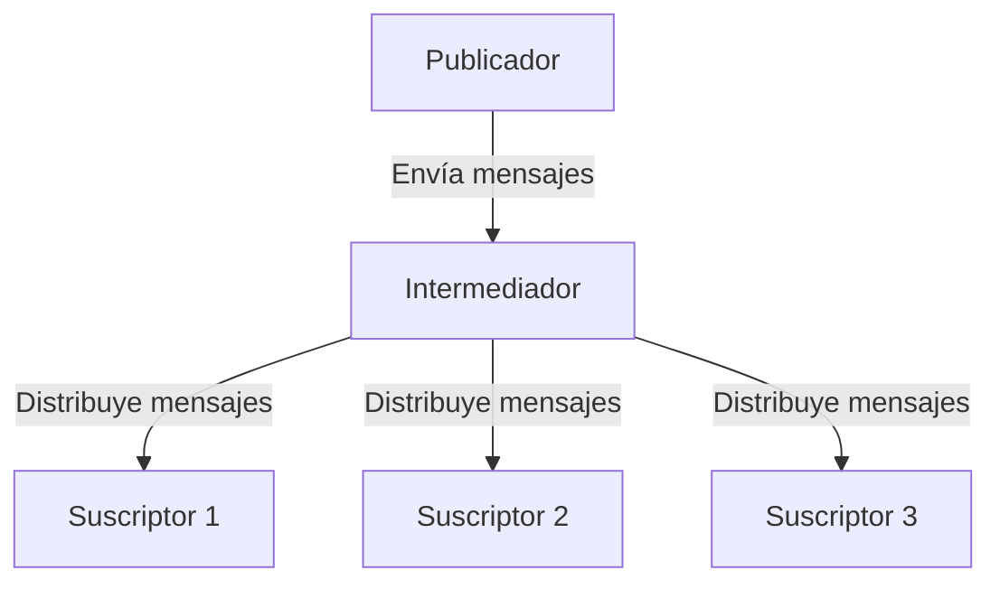

# Recopilación de datos

El análisis de datos comienza con la *recopilación* de datos. Podríamos separar la recopilación en dos grandes paradigmas:

- **Procesamiento por lotes** (*batch processing*): consiste en la recolección de una gran cantidad de datos históricos, típicamente una sola vez, o con una frecuencia tan baja que cada recopilación tiene una gran cantidad de datos. Ejemplos: los "famosos" datos de pasajeros del Titanic, los cuales necesariamente fueron recolectados una sola vez, o la información que utiliza YouTube o Netflix para entrenar sus sistemas de recomendaciones que, aunque son actualizados diariamente, contienen millones de nuevas interacciones en cada recopilación.
- **Procesamiento en tiempo real** (*real-time processing*): consiste en la recolección de datos al momento de su ocurrencia, esto es, basado en eventos (*event-driven*) o bien con una frecuencia de recopilación tan alta que solamente algunos pocos nuevos datos, o ninguno, son obtenidos en cada muestreo. Ejemplos: datos sobre terremotos, valores diarios de los mercados de valores o mediciones de redes de sensores recopiladas cada 10 segundos.

En medio de ambos hay una "zona gris", a menudo llamada **procesamiento en tiempo casi real** (*quasi real-time processing*), que captura la dinámica del sistema sin responder directamente a eventos o sin una frecuencia tan alta. Por ejemplo, la telemetría y rastreo en vehículos de transporte público actualiza datos cada 15 o 20 segundos, lo cual es suficiente para tener una buena estimación de su posición, pero no es totalmente "en tiempo real".

La definición, entonces, varía según el fenómeno analizado, que puede tener cambios muy frecuentes o no. Por ejemplo: un muestreo anual podría ser "tiempo real" en el análisis de fenómenos geológicos (lentos, por naturaleza).

!!! note "Definición informal de procesamiento en tiempo real" 
    Un flujo de datos en el cual el procesamiento de una nueva muestra inicia en el momento de su llegada y concluye antes de la llegada de la siguiente muestra o evento.

## Fuentes de datos

Los datos pueden venir de un solo archivo (ejemplo, un `.xlsx` o `.csv`), directamente de un sensor (ejemplo, un Arduino conectado a la computadora con un sensor de temperatura), o de una base de datos externa, siguiendo varios *modelos de comunicación* posibles, explicados a continuación.

### Modelos de comunicación

Algunos de los modelos de comunicación para compartir datos entre sistemas son:

- **Solicitud/respuesta**: donde una *solicitud* del *cliente* interactúa con los *recursos* de un *servidor* que devuelve una *respuesta*. Ejemplo: HTTP (el famoso "404 Not Found" es uno de los [códigos de estado de respuesta](https://developer.mozilla.org/es/docs/Web/HTTP/Reference/Status) posibles) o las interfaces de programación de aplicaciones web (web API, *Application Programming Interface*) que operan sobre HTTP y conectan distintos servicios de forma *programática*. 
- **Publicación/suscripción**: donde un *productor* (*producer*) *publica* un *mensaje* que coloca en un *canal* sobre un *tópico* y un *intermediador de mensajes* (*message broker*) lo distribuye a todos los procesos que están *suscritos*. Ejemplo: el monitoreo de eventos en la agricultura de precisión con una red de sensores conectada con [MQTT](https://mqtt.org/). 
- **WebSockets**: donde hay un canal de comunicación *bidireccional* con comunicación *persistente*. Ejemplo: en cualquier aplicación de chat (WhatsApp, Telegram, etc.) o videojuegos en línea, en las que la acción de un cliente es reflejada en los otros la interfaz de los otros clientes. Por ejemplo: cuando dice "*Fulanito está escribiendo…*" en un chat. Nota: HTTP es una conexión no persistente, a diferencia de los WebSockets.
- **Otros**

Una de las soluciones más populares es obtener datos de fuentes externas, y hacerlo por medio de un API o *interfaz de programación de aplicaciones*, como está descrito a continuación.

### Datos desde fuentes externas con API

En el **PyX** número 6 ([Py6](https://github.com/improbabilidades/PyX)) hay una amplia explicación sobre los web API y el uso del paquete `requests` de Python.

Hay una gran cantidad de API públicos disponibles en [Public APIs](https://publicapis.dev/) para experimentar con la recolección de datos.

El siguiente es un ejemplo con el API de GitHub, donde está disponible la información de la cuenta de las personas registradas.

```python title="playground.ipynb"
import requests

# Usuario(a) de GitHub
usuario = "fabianabarca"

# Construir la URL
api_url = "https://api.github.com/users/" + usuario

# Hacer la solicitud GET y guardar un "Response" en la variable r
r = requests.get(api_url)

# Convertir la información obtenida en JSON
datos = r.json()

# Extraer y mostrar algún dato particular
print("Compañía:", datos["company"])

# Resultado
# Compañía: Universidad de Costa Rica
```

**Nota**: En el archivo `playground.ipynb` (Notebook de Jupyter) de este repositorio pueden experimentar con este código.

### Datos desde fuentes externas con MQTT

MQTT (*Message Queuing Telemetry Transport*) es un protocolo de mensajería ligero y eficiente, diseñado para la comunicación entre dispositivos en redes con recursos limitados y bajo ancho de banda, como los del Internet de las Cosas (IoT). Utiliza el modelo pub/sub descrito anteriormente.



Todos los suscriptores a un tema van a recibir instantáneamente el mensaje enviado por el publicador. 

## Recopilación de datos en el proyecto

Para este proyecto haremos una recopilación de datos en **tiempo real** de un intermediador **MQTT**, para almacenarlos en una **base de datos relacional**.

Para esto es necesario un cliente MQTT, capaz de hacer una conexión TCP a un intermediador (*broker*), suscribirse a uno o más tópicos y recibir en tiempo real los mensajes en esos canales.

!!! info "Pruebas en un cliente MQTT en el navegador web"
    Es posible usar el sitio https://testclient-cloud.mqtt.cool/, en donde:

    - Configuración de la conexión ⚙️
        - *Protocol*: tcp
        - *Host*: mqtt.simovi.org
        - *Port*: 1883
        - *Username*: admin
        - *Password*: admin
        - *Save changes*
    - *Connect*
    - *Subscriptions*: test
    - *QoS 0*
    - *Subscribe*
    - Algunos mensajes deberían aparecer en la ventana.

El cliente MQTT será desarrollado con Python, a través del paquete [`paho-mqtt`](https://pypi.org/project/paho-mqtt/).